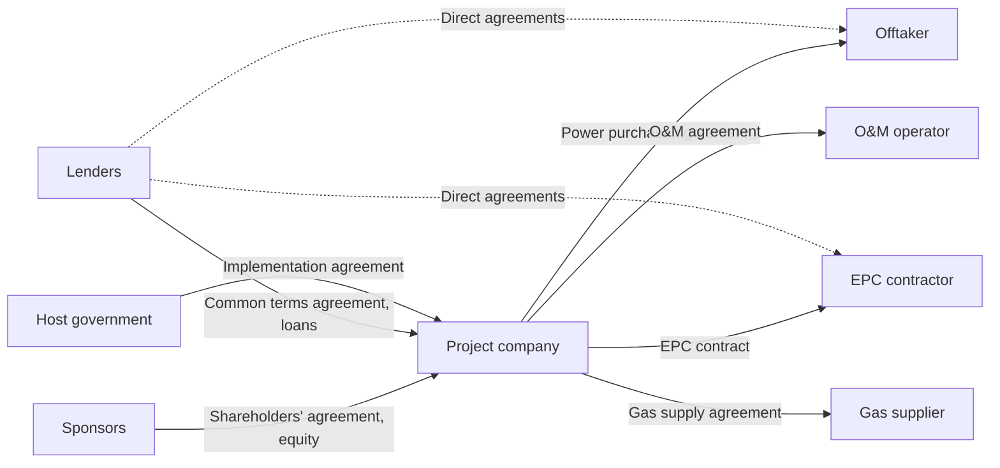
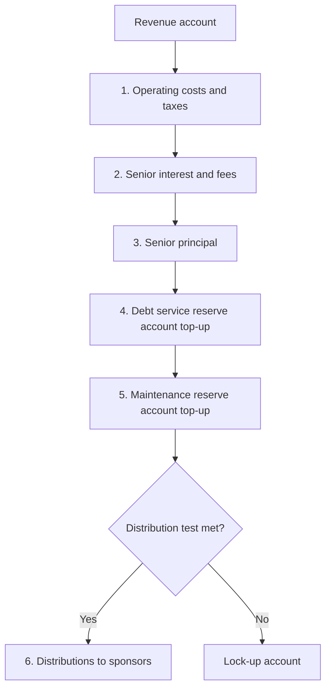
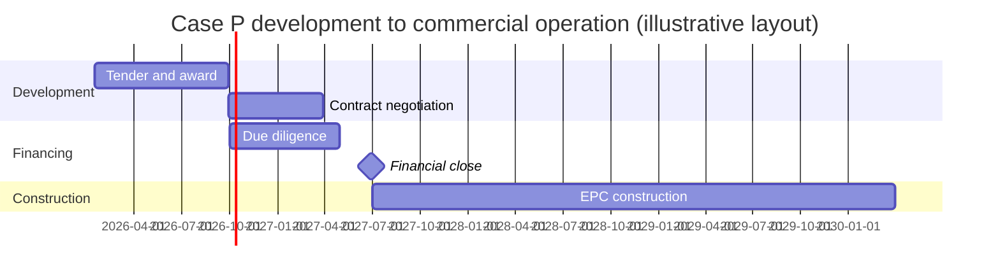
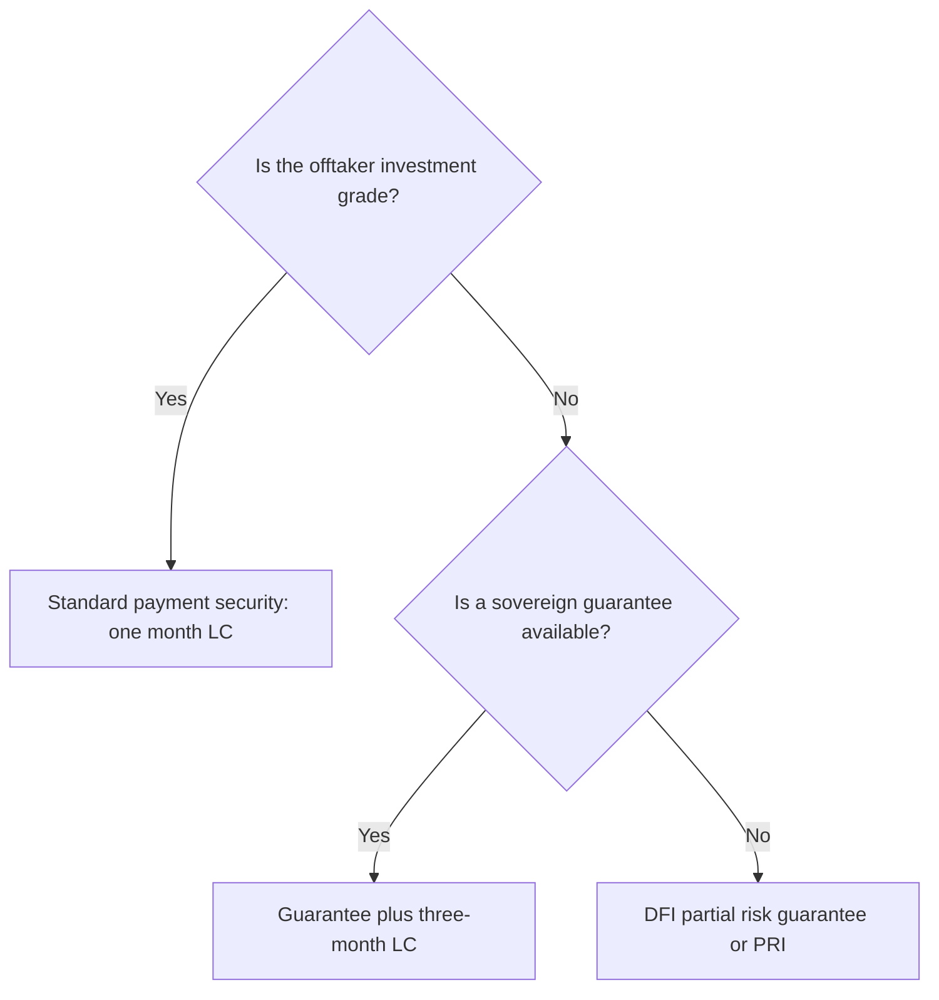

# Style sheet

Binding on every writer, reviewer, and editor. Where this sheet and `standards.md` differ, `standards.md` wins and the conflict is logged in `bible/decisions.md`. Every choice below is final; do not reopen one inside a chapter. Text that this sheet quotes as an example of what not to write is marked **[BAD]**; everything marked **[GOOD]** is a model to imitate. All figures in this sheet (delay days, DSCR ranges, dates, amounts) illustrate format only; they are not Case Bible figures or verified market data, and no writer may cite them.

## 1. Voice

### 1.1 The brilliant senior colleague

Write as the most capable person on the deal team, explaining something to a sharp new colleague at the end of a long day: direct, specific, warm, and willing to say what is hard or unresolved. The reader is a future peer. Never lecture, reassure, or flatter.

Concrete rules:

- Lead with the case, the number, or the scene, then state the general rule. A paragraph that opens with an abstraction must reach a concrete instance within two sentences.
- Every rule comes with its mechanism: what problem it solves, what breaks without it, and who pushed for it.
- Use "you" for the reader acting in a role ("You are the facility agent, and the borrower's compliance certificate is three days late"). Use "we" only for shared calculation steps ("we discount at 8.5%"). Never use "I".
- Wry is allowed once or twice a chapter, when the humor carries information. A joke that could appear in any book is cut.
- When practitioners disagree, give both positions, then say which one this book favors and why (`standards.md` Section 9).
- Market norms are always dated and placed: "In 2025–2026 European bank deals for contracted onshore wind, minimum DSCRs on P90 sat at roughly 1.20x to 1.25x." Never state a bare norm.

### 1.2 The four lenses in prose

Every major topic is seen from the sponsor, the lender, the host government, and the contractor or operator. Do not render this as a four-bullet list after every concept. Show it in prose through what each party needs, fears, and will trade, and let the lenses collide.

**[GOOD]** "The sponsor wants the delay liquidated damages capped at 15% of the contract price so the EPC contractor's bid stays low. The lenders want the cap high enough to pay interest for the full delay the independent engineer thinks plausible, which on Case P is 210 days, or about USD 38.4 million. The EPC contractor will accept a higher cap only if the price rises to cover it, and the host government, which reimburses capacity payments from the commercial operation date, does not care about the cap at all until the delay pushes power past the winter peak."

**[BAD]** "From the sponsor's perspective, the cap matters. From the lender's perspective, it also matters. The government and the contractor also have views."

A chapter passes the lens test when a reader can answer, for each major concept, "who loses money if this goes wrong, and what did they ask for in advance to prevent it?"

### 1.3 Running-case scenes

Running-case installments are scenes, not dramatized lectures. People interrupt, posture, bluff, misread each other, concede badly, and are sometimes wrong; the narration or a later section shows who was wrong and why. No character delivers a paragraph of exposition. No one says "As you know." No scene ends on a spoken or narrated moral. Physical detail appears only if it changes the outcome (the term sheet printed without the latest markup; the call where the ECA representative is on a train and keeps dropping out). Characters come only from the Case Bible.

**[BAD]** (mouthpiece speech)

> "As you know," said the lead arranger, "lenders size debt on P90 because the P50 is only a median estimate, and if production falls below it in any given year, the debt service coverage ratio could drop below the lock-up threshold, which would harm both lenders and sponsors. That is why we must insist on P90."
>
> The developer nodded thoughtfully. "That makes perfect sense."

**[GOOD]** (scene with friction)

> "One-point-three-five on P50," the developer said. "That's what Brightmoor got last quarter."
>
> "Brightmoor has a ten-year operating record. You have a met mast and a consultant's report." The arranger didn't look up from the sizing printout. "We're at one-point-two on the one-year P90."
>
> "That's eleven million less debt."
>
> "Twelve-point-four. I checked."
>
> The developer's counsel cut in. "If we take the P90 case, we want the lock-up at one-point-oh-five, not one-ten."
>
> "Different conversation."
>
> It was the same conversation, and both of them knew it: the lock-up level and the sizing case are two dials on the same risk.

The final sentence of the good example is narration that explains a mechanism. It does not moralize. Number words in dialogue are spelled as people say them; the narration then states the figure in numerals if the reader needs it (Section 2.3).

## 2. Spelling, usage, and numbers

### 2.1 American English

American spelling throughout prose: modeling, labor, program, center, defense, license (noun and verb), analyze, organization, judgment, fulfill, aging, sulfur, gray, catalog, enroll. Exceptions: proper names (Thames Tideway Tunnel, Ministry of Defence), titles of sources, and drafted clauses that state English law as governing law, which may use British forms ("Utilisation Request") because that is how such documents are drafted. Use "financial close" (not "financial closing"), "per year" (not "per annum" outside clauses), "lawsuit" only for US litigation.

Serial (Oxford) comma always: "the sponsor, the lenders, and the offtaker." Single space after periods. Double quotation marks; single quotation marks only inside double. Periods and commas go inside closing quotation marks (American convention), except when quoting a defined code string or Excel formula, which go in code spans.

Hyphenate compound modifiers before a noun when needed for sense (a 20-year PPA, a fixed-price contract), never after it (the PPA runs for 20 years). Never stack more than two hyphenated compound modifiers in one noun phrase.

### 2.2 Dates and periods

- Prose dates: month-day-year with a comma: **October 3, 2026**. Month and year only: "October 2026" (no comma).
- Table cells, Mermaid timelines, and the model: ISO format **2026-10-03**.
- Decades: "the 1990s". Ranges: "2019–2023" with an en dash and no spaces.
- Project time: the first full year of operation is **Operating Year 1** in prose and **OY1** in tables. Construction months are **Month 1** to **Month 34** counted from notice to proceed.
- Calendar periods: Q3 2027, H1 2028. Fiscal years: **FY2027** (no space), and the chapter states once when the fiscal year ends ("FY2027 ends June 30, 2027").
- Model periods are named by their end date: "the period ending June 30, 2028."

### 2.3 Numbers

- Spell out one to nine in prose; use numerals for 10 and above. Always use numerals with units, money, percentages, ratios, multiples, section and exhibit numbers, years, and model periods ("3 MW", "USD 4.0 million", "5%", "Year 7", "Exhibit 36.2").
- Never begin a sentence with a numeral; rewrite the sentence rather than spell out a large figure.
- Thousands separator is a comma: 12,450 hours. Decimal point is a period.
- Use "million" and "billion" in prose, never "mn", "mm", "bn", or "MM" (except in the unit MMBtu).
- In dialogue, write numbers as spoken ("one-point-two"); the narration supplies the numeral if it matters.
- Approximate real-world figures carry "approximately" (Section 9). Illustrative figures must look like real data: USD 412.6 million, not USD 400 million.

### 2.4 Money

- ISO code before the amount, separated by a space, no currency symbols: **USD 412.6 million**, **EUR 85.0 million**, **GBP 1.2 billion**, **USD 45,000**.
- Default precision: millions to one decimal place in prose and tables. Billions to one decimal place when the figure is above USD 1,000 million and precision is not the point; otherwise keep millions (USD 1,184.3 million in a sources-and-uses table).
- Table headers carry the unit: "USD m". Cells then hold bare numbers: 412.6.
- Unit prices: two decimals: USD 52.40/MWh, USD 6.85/MMBtu, USD 3.15 per vehicle trip. Write "per" when the denominator is not a standard unit.
- Fictional currencies: the Case Bible assigns each fictional country a three-letter code that is not an existing ISO 4217 code. Write them exactly like USD amounts. Every local-currency figure that matters to the reader appears with its USD equivalent and the exchange rate used, once per example: "KDR 9,860.0 million (USD 76.4 million at KDR 129.05 per USD)."
- Exchange rates: "KDR 129.05 per USD" in prose; table header "KDR/USD".
- Real versus nominal: say which, once per example: "USD 52.40/MWh in 2026 real terms."

### 2.5 Percentages, rates, basis points, multiples, ratios

- Percentages: numeral plus % with no space: 8.5%, 75%. "Percentage points" (written out) for differences between percentages: "gearing rose by 5 percentage points."
- Interest rates and reference rates: two decimals when quoted as a rate: SOFR 4.31%, all-in rate 6.56%. Returns: one decimal: equity IRR 13.8%.
- Basis points: numeral plus **bps** with a space: 175 bps, 25 bps. Use bps for margins, fees, spreads, and changes in rates; use % for rate levels.
- Cover ratios and multiples: two decimals plus a lowercase x with no space: **1.35x**, 0.98x, 2.10x. Applies to DSCR, LLCR, PLCR, net debt to EBITDA, and money multiples (MOIC 1.85x).
- Gearing: percentage with one decimal in tables (75.0%), and no decimal in prose when round (75%). Debt-to-equity as a ratio: 75:25.
- P-values: P50, P90, P99 with no space or hyphen. Specify horizon when it matters: "one-year P90," "ten-year P90."

### 2.6 Units

SI and industry units, with a space between numeral and unit: 650 MW, 4,725 GWh, 0.8 kWh, 7,150 kJ/kWh, 28 km, 120,000 bbl/d, 4.5 mtpa, 110 kV, 1,450 MMBtu. Rules:

- Capacity in MW or GW; energy in kWh, MWh, GWh, or TWh. Never confuse them, and never write "MW per hour".
- Price per unit: currency code, slash, unit: **USD/MWh**, **USD/MMBtu**, **USD/kW-month**, **USD/t**. No dollar sign anywhere.
- Heat rate in kJ/kWh (net, LHV unless stated); give Btu/kWh in parentheses only where US practice is the subject.
- Gas: MMBtu for energy, MMscfd for flow, bcm for annual volume; LNG in mtpa.
- Oil: bbl and bbl/d. Mining: t, Mt, g/t, %Cu.
- Traffic: vehicles per day (vpd after first use), AADT for annual average daily traffic.
- Time: hours (h) in tables, "hours" in prose.

### 2.7 Signs in tables and models

- Tables: negative numbers in parentheses: (12.4). Zero shown as a dash "–" in financial tables, as 0.0 in calculation tables where zero is a result being checked.
- Prose and formulas: a true minus sign (−12.4 in LaTeX: $-12.4$). Prefer words in prose: "an outflow of USD 12.4 million."
- Model sign convention: costs and outflows are stored as positive numbers on calculation sheets and subtracted explicitly in formulas; the cash flow statement and waterfall display outflows in parentheses. State this convention once in Chapter 39 and cross-reference it.

## 3. Structure, numbering, and headings

### 3.1 Heading formats

All headings are sentence case (only the first word and proper nouns capitalized). Exact Markdown:

```text
# Part VI — Structuring Debt                    (Part opener files only; Part titles in title case)
# Chapter 36 — Sizing and sculpting debt         (H1, one per chapter file)
## 36.3 Sizing debt to a minimum DSCR            (H2, numbered section)
### 36.3.2 Sculpting to a target ratio           (H3, numbered subsection)
#### Example 36.4. Sizing one semiannual period (Illustrative)
#### Exercise 36.7
#### Solution 36.7
```

The em dash with a space on each side is the fixed separator in Part and Chapter headings only; it does not count toward the prose dash limit. No other heading uses a dash. Section numbers have no trailing period ("## 36.3 Sizing", not "## 36.3. Sizing"); example, exercise, and solution numbers end with a period before their title. Do not go deeper than H4. Headings name their content plainly (`standards.md` Section 8, "Headings and titles"): "Sizing debt to a minimum DSCR," never "The art of debt sizing." Fixed labels followed by a colon are allowed only for the patterns in Section 4 ("Case P:", "Walkthrough:").

### 3.2 Numbered objects

| Object | Label | Numbering | Example |
|---|---|---|---|
| Worked example | Example | per chapter, sequential | Example 36.4 |
| Table, chart, or diagram | Exhibit | per chapter, sequential, one series for tables and diagrams | Exhibit 36.2 |
| Exercise | Exercise | per chapter, sequential across all tiers | Exercise 36.11 |
| Drafted clause excerpt | Clause | per chapter, sequential; variants take a, b, c | Clause 18.3, Clause 18.3b |
| Framework | Framework | per book, by home chapter | Framework 28.2 |
| Formula | equation tag | per chapter, in display math | (36.1) |

Exhibit captions sit above the table or diagram, on their own line, in this exact form, with the unit and status in parentheses:

```text
Exhibit 36.2. Case P debt sizing on the banking case (USD m)
```

Below the exhibit, a source line and, if needed, a note line:

```text
Source: Case P reference model, banking case, version of Chapter 36.
Note: Figures may not sum because of rounding.
```

Use "Figures may not sum because of rounding" only when that is true and the reconciliation line (Section 6.1) shows the difference.

Formulas that other text cites carry a tag: `$$ \text{DSCR}_t = \frac{\text{CFADS}_t}{\text{DS}_t} \tag{35.1} $$` and are cited as "equation (35.1)".

### 3.3 Status labels: Illustrative, running case, real case

Every example, exhibit, and clause carries exactly one status label in its heading or caption:

- **(Illustrative)**: invented numbers or facts outside the running cases.
- **(Case P)**, **(Case T)**, **(Case R)**: running-case material taken from the Case Bible.
- **(Real case: Name, year)**: e.g., "(Real case: Paiton I, 1999–2002)".

Clauses are always Illustrative and say so (Section 7).

### 3.4 Cross-references

- Backward: "see Section 36.4", "Example 40.3 showed", "the waterfall in Exhibit 52.1", "equation (35.1)", "Framework 28.2 (the Who-pays-if trace)". Capitalize Section, Chapter, Example, Exhibit, Exercise, Clause, and Framework when followed by a number.
- Forward: one or two sentences at most, always with the destination: "Chapter 37 shows how the debt service reserve is sized; here, assume it holds six months of debt service." Never "we will see later" or "more on this below."
- Never "as discussed earlier", "as mentioned above", or "as we have seen." Use a section number or nothing.
- Cite numbers from the anchor registry only. If an anchor is missing, report it; do not invent a number.

## 4. Required chapter elements and their headings

Every chapter file follows this skeleton. Bracketed text is replaced by the writer. Numbered sections continue sequentially; the actual numbers depend on the chapter.

```text
# Chapter 36 — Sizing and sculpting debt

[Opening: two to eight paragraphs, no heading. A real deal moment, a failure,
a puzzle, or a running-case scene.]

## What you will be able to do

[Two to four lines, each starting with a verb and ending with the capability
number from standards.md Section 3, e.g. "(Capability 5)". A true list.]

## 36.1 [Plain specific heading]
... core teaching sections, worked examples, walkthroughs, frameworks,
real cases ...
## 36.6 Walkthrough: [the artifact or task]
## 36.7 Case P: [what happens in this installment]
## 36.9 Practitioner's notebook
## 36.10 Judgment drill
## 36.11 [Plain specific heading for the close]
## 36.12 Exercises
## 36.13 Solutions to exercises
## Sources
```

Rules for each element:

- Opening: no heading and no announcement of the chapter's contents. It must create a need the chapter fills.
- What you will be able to do: the only unnumbered H2 besides Sources. Two to four lines.
- Walkthrough: heading "Walkthrough:" plus the specific artifact ("Walkthrough: reading an independent engineer's construction report"). A chapter may have several, each its own section.
- Real cases: section heading names the deal and what it teaches ("36.5 Ichthys LNG and cost growth under ECA cover"). Examples analyzing a real case use the "(Real case: …)" label.
- Running case: heading begins "Case P:", "Case T:", or "Case R:".
- Practitioner's notebook: one section with these H3 subsections, in this order, each omitted only when the chapter has nothing for it: "### Checklist", "### Red flags", "### Rules of thumb and their limits", "### Common mistakes", "### Questions experts ask". Lists are allowed here because these are true checklists; every item is a full sentence with a reason, never a bold label plus colon.
- Judgment drill: H3 subsections "### The situation" (second person, specific, with numbers and a deadline), "### Reasoning it through" (prose, showing trade-offs and the answer an expert gives), and "### What would change the answer" (named conditions and the direction each moves the decision).
- Close: a numbered section with a specific heading that states the open problem or the idea it crystallizes ("36.11 Sizing fixes the debt; the reserves decide whether it survives a bad year"). Never **[BAD]** "Conclusion", "Summary", "Key takeaways", "Wrapping up", or "Looking ahead". The last paragraph poses a real problem that the next chapter solves, stated concretely.
- Exercises: H3 subsections for tiers, exactly: "### Tier 1: Concept checks", "### Tier 2: Calculation and drafting", "### Tier 3: Case problems and model tasks". Exercises are numbered continuously across tiers (36.1 to 36.15) under H4 headings "#### Exercise 36.7". Each Tier 3 exercise states the starting file or the Case Bible figures it uses.
- Solutions to exercises: H4 headings "#### Solution 36.7" in the same order. Each solution gives the answer in its first sentence, then every step, then a reconciliation or check, then (for Tier 2 and 3) the most common wrong answer and why it is wrong. Drafting solutions give a model clause in the Section 7 format plus annotations.
- Sources: final H2, unnumbered, in the format of Section 9.2. Omit only if the chapter cites no real-world fact.

No other boxes, callouts, or labels. **[BAD]** "Pro tip", "Key insight", "Remember", "Fun fact", and similar labels are banned; a point worth making goes in the prose. The "Note:" line under an exhibit (Section 3.2) is the only permitted label of that kind.

## 5. Notation and Excel

### 5.1 LaTeX conventions

Inline math with `$…$`; display math with `$$…$$` on its own lines. Multi-letter variables are set in `\text{}` so they do not render as products: `$\text{CFADS}_t$`, not `$CFADS_t$`. Time subscript is always $t$. Use `\times` for multiplication, never `*` or `.`. Every display formula is followed immediately by a sentence defining any symbol not already in the canon below, then its Excel implementation.

### 5.2 Symbol canon

| Symbol (LaTeX) | Meaning | Unit |
|---|---|---|
| $t$ | period index (model period, usually semiannual) | – |
| $n$ | number of periods; $N$ for final period of the loan | – |
| $T$ | final period of the project or concession life | – |
| $r$ | discount rate per period | % |
| $i$ | interest rate per period on debt | % |
| $\text{DF}_t$ | discount factor, $\text{DF}_t = (1+r)^{-t}$ | – |
| $\text{NPV}$ | net present value | currency |
| $\text{IRR}$ | internal rate of return | % |
| $\text{CF}_t$ | generic cash flow in period $t$ | currency |
| $\text{Rev}_t$ | revenue | currency |
| $\text{Opex}_t$ | operating costs | currency |
| $\text{Capex}_t$ | capital expenditure | currency |
| $\text{Tax}_t$ | cash tax paid | currency |
| $\Delta\text{WC}_t$ | change in working capital (increase is a use of cash) | currency |
| $\text{CFADS}_t$ | cash flow available for debt service | currency |
| $P_t$ | scheduled principal repayment | currency |
| $I_t$ | interest paid | currency |
| $\text{DS}_t$ | debt service, $P_t + I_t$ | currency |
| $D_t$ | debt outstanding at the start of period $t$ | currency |
| $\text{DSCR}_t$ | debt service cover ratio | x |
| $\text{DSCR}^{\text{target}}$ | sculpting target ratio | x |
| $\text{LLCR}_t$ | loan life cover ratio | x |
| $\text{PLCR}_t$ | project life cover ratio | x |
| $G$ | gearing, debt as share of total funding | % |
| $E$ | equity amount | currency |
| $\text{P50}, \text{P90}, \text{P99}$ | exceedance levels of a resource or output estimate | as quantity |
| $\sigma$ | standard deviation (state whether one-year or ten-year) | as quantity or % |
| $A_t$ | availability factor | % |
| $C$ | contracted (or declared) capacity | MW |
| $\text{CP}_t$ | capacity payment | currency |
| $\text{cpr}$ | capacity payment rate | USD/kW-month |
| $\text{EP}_t$ | energy payment | currency |
| $E^{\text{del}}_t$ | energy delivered | MWh |
| $\text{HR}$ | net heat rate | kJ/kWh |
| $p^{\text{fuel}}_t$ | fuel price | USD/MMBtu |
| $\text{CPI}_t$ | price index level; indexation factor $\text{IF}_t = \text{CPI}_t / \text{CPI}_0$ | – |
| $\text{FX}_t$ | exchange rate, local currency per USD | LCY/USD |
| $\text{LD}$ | liquidated damages | currency |

Core formulas, stated once here and owned by their home chapters:

$$ \text{CFADS}_t = \text{Rev}_t - \text{Opex}_t - \text{Tax}_t - \Delta\text{WC}_t $$

(reserve movements and other adjustments are added in Chapter 35, which owns the full definition)

$$ \text{DSCR}_t = \frac{\text{CFADS}_t}{\text{DS}_t} \qquad \text{LLCR}_t = \frac{\sum_{k=t}^{N} \text{CFADS}_k \times \text{DF}_k / \text{DF}_{t-1} + \text{DSRA}_t}{D_t} $$

$$ \text{CP}_t = C \times 1{,}000 \times \text{cpr} \times \text{IF}_t \times A_t \times m_t \qquad \text{EP}_t = E^{\text{del}}_t \times \frac{\text{HR} \times p^{\text{fuel}}_t}{1{,}055.06} $$

where $m_t$ is months in the period, 1,000 converts MW to kW, and 1,055.06 converts MWh multiplied by kJ/kWh into MMBtu (1 MMBtu = 1,055,056 kJ); the heat-rate pass-through form is owned by Chapter 18, which also states the variable O&M component. LLCR conventions (discount at the weighted debt rate, DSRA inclusion) are owned by Chapter 35; the form above is the default.

### 5.3 Formula then Excel

Every formula the reader must build is followed by its Excel implementation, introduced by a sentence stating the cell layout. Short formulas go in a code span; anything longer, or any set of rows, goes in a fenced `text` block. Formulas are written for the first timeline column and copied right.

**[GOOD]**

> In the Ratios sheet, CFADS sits in row 12 and debt service in row 14, with the first operating period in column J. The DSCR for that period, in J16, is `=IF(J$8=1, J12/J14, "")`, where row 8 is the debt repayment flag on the Time sheet linked in.

```text
Ratios!J12   CFADS                USD m   =Waterfall!J40
Ratios!J14   Debt service         USD m   =Debt!J55+Debt!J61
Ratios!J16   DSCR                 x       =IF(J$8=1, J12/J14, "")
```

### 5.4 Model conventions (FAST-consistent)

- Workbook sheets, in this order: Cover, Inputs, Time, Construction, Operations, Tax, Funding, Debt, Reserves, Waterfall, Financials, Ratios, Returns, Checks, Outputs. Sheet names are capitalized single words, cited in prose without quotes: "the Debt sheet".
- Time runs across columns; one row, one calculation, one formula copied across the whole row. Columns: A–C indent levels for grouping, D label, E units, F constants (single-value inputs or links), G row total or check, H–I blank, J first model period. The timeline is monthly in construction and semiannual in operations in Case P; the Time sheet builds a flag for each phase.
- Every row has a unit in column E: USD m, MWh, %, x, flag, date, factor.
- Flags are 1 or 0 and named with a "Flag" prefix in the label column: `Flag_Construction`, `Flag_Operations`, `Flag_Repayment`, `Flag_FirstOpsPeriod`. Prose calls them "the construction flag." Never use TRUE/FALSE as flags.
- Cell references in prose: Sheet!Cell, e.g., "Debt!J55". Row references: "row 55 of the Debt sheet". No range names except the scenario selector (`Scenario`), a decision fixed in Chapter 13.
- Colors: inputs blue font (RGB 0, 0, 255) on pale yellow fill; calculations black font, no fill; links from another sheet green font; checks show 0 when passing and red fill with nonzero value when failing. Exhibits showing sheets describe colors in words because Markdown cannot show them.
- Banned functions on calculation sheets: OFFSET, INDIRECT, merged cells, hard-coded numbers inside formulas (except 0, 1, 12, and unit conversions labeled in column E). Circularity is resolved by the method fixed in Chapter 40; writers before Chapter 40 forward-reference it.

## 6. Tables and diagrams

### 6.1 Tables

Use a table when the reader compares three or more numbers, or two or more items across two or more attributes. Two numbers belong in a sentence. Rules:

- Caption above (Section 3.2). Units in the caption when the whole table shares them ("(USD m)"); otherwise in each column header ("Capacity (MW)").
- Text columns left-aligned; number columns right-aligned (`---:` in Markdown). Same decimals in a column.
- Totals rows are labeled "Total" and placed last. Subtotals are labeled with what they are ("CFADS", "Total uses").
- Every table that must reconcile ends with a check line in the note or a "Difference" row: "Sources minus uses: 0.0." Rounding differences are shown, not hidden.
- Years or periods run across columns when there are more than four; items run down rows. Match model orientation.
- No empty cells: use "–" for nil and "n/a" for not applicable.

### 6.2 Mermaid conventions

All diagrams are Mermaid code blocks with an Exhibit caption above. Rules:

- Contract maps and process flows: `flowchart LR`. Cash waterfalls and decision trees: `flowchart TD`. Timelines: `gantt` with `dateFormat YYYY-MM-DD`.
- Node IDs are short uppercase codes (PC, SPON, LEND, OFF, GOV, EPC, OM, IE); labels in double quotes, sentence case, using canonical terms (Section 8). Edge labels name the contract or the flow and are in double quotes after the pipe syntax.
- At most 15 nodes per diagram. No colors, icons, or `style`/`classDef` lines, except one `classDef` allowed to mark the project company. No numbers in diagrams except dates in gantt charts; amounts go in tables.
- Decision nodes in trees use the diamond `{}` shape and pose a yes/no condition.

Contract map:



Cash waterfall:



Timeline:



Decision tree:



Gantt dates shown in an exhibit must match the Case Bible; the timeline above is a format example only.

## 7. Drafted clause excerpts

All clause language is drafted originally for this book. Never reproduce or closely paraphrase LMA, LSTA, APLMA, FIDIC, ISDA, government standard forms, textbooks, or published contracts. A writer who recognizes a published formulation in a draft rewrites it from the principle.

Format:

- Caption line above, like an exhibit: `Clause 18.3. Deemed energy payment, PPA (Illustrative, lender-friendly)`. The caption names the document and the variant. Variants of one clause take letters: Clause 18.3a (sponsor-friendly), 18.3b (lender-friendly), 18.3c (government-friendly). A clause with no negotiation angle has no letter and no variant tag.
- The clause text is a Markdown block quote. Paragraphs inside are lettered (a), (b), (c) and sub-lettered (i), (ii). Defined terms inside the clause are capitalized, as in real drafting, and may follow English-law spelling where the governing law is English law.
- Annotations follow immediately, as a numbered list keyed to the paragraph letters: "1. Paragraph (a)." then one to four sentences saying what the words do, who they protect, and what a party would push to change. Annotate every paragraph.
- Variants: present the three variants in sequence, each with its annotations, then a prose paragraph titled by its first words, "Where it usually lands", stating the market outcome with market and date ("In Sub-Saharan African IPPs closed 2018–2025, the compromise was…").

**[GOOD]**

Clause 18.3a. Deemed energy, PPA (Illustrative, sponsor-friendly)

> (a) If the Seller is able and offers to deliver Net Energy Output and the Buyer fails to accept it for any reason other than Seller Fault, the Buyer shall pay for Deemed Energy as if it had been delivered.
>
> (b) Deemed Energy for any hour equals the Available Capacity declared for that hour less Net Energy Output actually accepted.

1. Paragraph (a). "For any reason other than Seller Fault" puts grid outages, dispatch errors, and transmission failure on the offtaker. The offtaker will try to narrow this to listed causes.
2. Paragraph (b). Basing the calculation on declared capacity, not tested capacity, lets the seller overstate availability; the lender-friendly variant adds an independent engineer check.

## 8. Defined terms and canonical names

### 8.1 Bold at first definition only

A term is bold once in the book: at its home definition (the section that owns it per `architecture.md`). Bold appears nowhere else, for any purpose. Acronyms: write the full term, then the acronym in parentheses: "**debt service cover ratio** (DSCR)". At the first use in each later chapter, write the full term once again (not bold) with the acronym, then use the acronym. Exempt from re-expansion: USD and other currency codes, MW, MWh, GWh, kWh, and the running-case labels Case P, Case T, Case R. Do not create acronyms used fewer than three times in a chapter.

Common nouns that are defined terms in this book stay lowercase in prose ("project company", "financial close", "commercial operation date"). Capitalized forms appear only inside drafted clauses.

### 8.2 Canonical forms

Use exactly these forms. A different word signals a different thing.

| Canonical form | Acronym | Not |
|---|---|---|
| project company | – | SPV, vehicle, entity, borrower, ProjectCo (SPV only when discussing the legal form itself, Chapter 2) |
| sponsor, sponsors | – | developer (except for the developer character or a pure developer company), shareholder (except in shareholder-agreement context) |
| lenders | – | banks (unless only banks), financiers, creditors (except in insolvency) |
| senior lenders | – | used only when distinguishing from mezzanine or holdco lenders |
| offtaker | – | buyer, purchaser, off-taker, off taker (Buyer only inside clauses) |
| host government | – | the state, the government (alone), authorities |
| contracting authority | – | Case T and PPP chapters only: the public body that signs the PPP contract |
| EPC contractor | – | contractor (alone), builder, EPC firm |
| O&M operator | – | operator (alone), O&M contractor, O&M provider |
| LTSA provider | LTSA | OEM service provider |
| independent engineer | IE | lenders' technical advisor, LTA |
| facility agent | – | agent bank, administrative agent (except US-law contexts, noted once) |
| intercreditor agent | – | intercreditor representative |
| security agent | – | collateral agent, security trustee (security trustee only in Chapter 52 when the trust mechanism is the topic) |
| export credit agency | ECA | – |
| development finance institution | DFI | multilateral (alone) |
| engineering, procurement, and construction | EPC | – |
| power purchase agreement | PPA | power offtake agreement |
| commercial operation date | COD | completion date (completion is a separate defined term in finance documents) |
| financial close | – | closing, financial closing |
| cash flow available for debt service | CFADS | – |
| debt service reserve account | DSRA | – |
| gearing | – | leverage (except in the technical sense of debt's effect on returns, Chapter 8) |

## 9. Real cases and sources

### 9.1 Presenting real cases

- First mention names the project, country, and dates: "Paiton I, a 1,230 MW coal plant in East Java, Indonesia, reached financial close in 1995." Use the figures and dates in the fact sheet for that case in `book/facts/`.
- Figures that are approximate carry "approximately" before the number: "approximately USD 2.5 billion." Never round a precise sourced figure without marking it.
- Never quote a real person or document unless the fact sheet gives the exact words and source. Paraphrase otherwise.
- Facts come only from `book/facts/` sheets. A writer who needs a fact not in the sheets verifies it from at least one primary or reputable secondary source and lists it in the status note under "verification flags" with the source.
- In-text citation: author-date in parentheses at the first statement of a sourced figure or claim: "(MIGA 2016)". No footnotes.
- The lesson of a real case is stated as a mechanism the reader can apply, never as a moral.

### 9.2 Sources list format

Final H2 "Sources". Entries alphabetical by author or organization, one paragraph each (not bullets), Chicago author-date style:

```text
Asian Development Bank. 2021. Title of the Report in Title Case. Manila: Asian Development Bank. https://www.example.org/report. Accessed October 3, 2026.

Surname, Given Name, and Given Name Surname. 2019. "Article Title in Title Case." Journal Name 12 (3): 45–67.
```

Titles of reports and books in italics (`*Title*`); article titles in quotation marks. Every in-text citation resolves to exactly one entry. The date accessed is required for web sources.

## 10. Prose enforcement: the ten tics technical writers fall into most

The full list is `standards.md` Section 8, "AI writing tics to avoid". Writers scan for all of it. The ten below recur most in technical drafts, with the rewrite strategy for each. Quoted text in this section is **[BAD]** unless marked otherwise.

1. Em dashes. **[BAD]** "The DSRA (a reserve) — usually six months — protects lenders — and sponsors pay for it." Rule: at most one dash or dash pair per paragraph; most paragraphs have none. Rewrite with a period, comma, or parentheses, and do not substitute semicolons wholesale. Writers run `grep -c "—"` per paragraph before submission.
2. Inflated verbs and adjectives: "crucial", "robust", "ensure", "leverage" (as "use"), "key" (as an adjective), "facilitate". Rewrite by naming what the thing does: "the reserve pays six months of debt service" instead of "the reserve plays a crucial role in ensuring robust debt service."
3. Vague "This" opening a sentence. **[BAD]** "This means lenders are protected." Rewrite with the noun: "The cap means lenders recover delay costs up to USD 38.4 million."
4. False-contrast reframes. **[BAD]** "A DSRA isn't just a reserve; it's a signal." Rewrite as the positive claim with its mechanism, or delete.
5. Tacked-on significance clauses. **[BAD]** "…, highlighting the importance of contract design." Rewrite as a separate claim with evidence, or cut.
6. Signposted enumeration and the reflexive rule of three. **[BAD]** "There are three reasons. First…" Rewrite as connected prose in order of importance, with as many items as the content has.
7. Hedge stacking and reflexive "can" or "may". **[BAD]** "This can potentially lead to issues in many cases." Rewrite with the condition and frequency: "When the offtaker pays more than 60 days late, the DSRA is drawn."
8. Elegant variation. **[BAD]** "the project company… the SPV… the borrower… the vehicle." Rewrite using the canonical term from Section 8.2 every time.
9. Zinger endings and summary sandwiches. **[BAD]** "And that is the whole game." Cut the last sentence of any paragraph that restates the paragraph. Sections end on their last substantive point.
10. "It depends" without direction, and non-conclusions. **[BAD]** "The right tenor depends on many factors." Rewrite by naming the two or three decisive factors, ranking them, and saying which way each moves the answer and by how much.

Swapping a banned word for a synonym is the same failure (`standards.md` Section 8, "Applying the list"). Writers also run a banned-word scan on every chapter file before reporting done, using the lists in `standards.md` Section 8, and report the count in the status note.

## 11. Sample passage

The passage below demonstrates the voice and every rule above. It is the reference for tone and density. (Illustrative)

> Take a 120 MW wind farm whose consultant forecasts 380.0 GWh a year at **P50**, the output level the farm is expected to beat in half of all years. At a tariff of USD 52.40/MWh, that is revenue of USD 19.9 million. Operating costs are USD 6.1 million, so CFADS is USD 13.8 million.
>
> Suppose the lenders sized the debt on that P50 case at a minimum DSCR of 1.30x. Annual debt service would be USD 10.6 million. Now give the wind a bad year. If annual output has a standard deviation of 10%, the one-year **P90**, the level beaten in 90% of years, is 331.3 GWh. Revenue falls to USD 17.4 million, CFADS to USD 11.3 million, and the DSCR to 1.06x. A typical lock-up test blocks distributions below 1.10x, so one ordinary bad year would trap the sponsors' cash in the project company.
>
> Lenders therefore run the sizing on P90 as well and ask the bad year to clear its own ratio. At 1.20x on the P90 case, debt service drops to USD 9.4 million, and the sponsors lose USD 1.2 million a year of debt capacity. That USD 1.2 million buys the lenders a structure in which the predictable bad year pays its debt service with room to spare, while only a rarer, worse year tests the reserve account.

Word count of the passage: about 200 words. Dashes: none. Numbers checked: 380.0 × 52.40 = 19,912 (USD 19.9 million); 19.912 − 6.1 = 13.812; 13.812 / 1.30 = 10.62; 380.0 × (1 − 1.2816 × 0.10) = 331.3 GWh; 331.3 × 52.40 = 17,360 (USD 17.4 million); 17.360 − 6.1 = 11.26; 11.26 / 10.62 = 1.06x; 11.26 / 1.20 = 9.38 (USD 9.4 million); 10.62 − 9.38 = 1.24 (USD 1.2 million).
