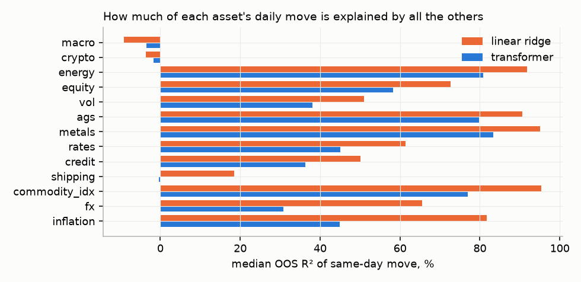
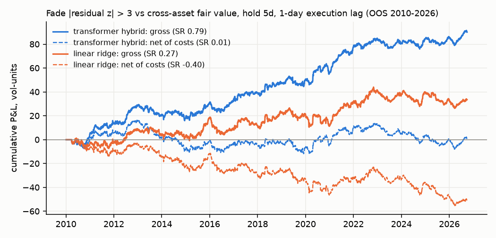

# Cross-asset transformer: nonlinear relationships and mispricings

Data: `DOC-20260929-WA0014.xlsx`, sheet `PCA`. 369 Bloomberg series, daily (weekdays), 2001-01-01 to 2026-09-29.
The xlsx is not committed. Rerun steps are at the bottom.

## Bottom line

1. **Most of the structure is linear.** A ridge model using the other 368 series explains 70% of a typical
   asset's same-day move out of sample. Most of that is curves, sectors, and FX crosses moving together.
   The transformer adds only a little on top: pooled R² goes from 69.8% to 70.4%, and it is better on 64% of series.
2. **The nonlinear part matters most for finding mispricings.** Residuals from the transformer's fair value
   mean-revert over the following week. Residuals from the linear fair value do not.
   - IC of the signal against the next week's residual: **0.019 (t = 5.6)** for the transformer vs 0.002 (t = 0.5) for linear.
   - Fading residuals above 3σ, holding 5 days, with a 1-day execution lag: **gross Sharpe 0.79 vs 0.27 for linear**.
   - The transformer comes out ahead in every threshold, holding-period, and universe combination tested.
3. **The edge is small after costs.** Net of rough bid/ask costs, the |z|>3 / 5-day version has Sharpe ≈ 0.0 on the full universe.
   Restricted to rates, ags, energy, and metals it has **net Sharpe ≈ 0.56**. That universe was picked
   *after* seeing the results by class, so treat it as a hypothesis to test forward, not a proven edge.
4. **There is no usable directional forecast.** Next-day predictability looks large (IC 0.08, t = 30, gross Sharpe 7.5).
   Almost all of it comes from markets closing at different times: US moves at day t predict the Asian and European closes on t+1.
   With a one-day execution lag it is gone.
   - The transformer's nonlinear correction was stopped early on validation data in every fold, so it found nothing beyond linear here.
   - The best version (5-day horizon, slow position smoothing) has net Sharpe 0.38, with long flat periods.




## Method

**Transforms** (`mt/data.py`):
- **First differences:** all government yields (US, G10, EM), real yields, breakevens, and inflation swaps; fed funds and
  €STR/OIS rates; STIR futures (FF, ER), which are quoted as 100 − rate, so they are really rates; CDS spread indices (IG, iTraxx,
  Xover, SNRFIN, SUBFIN); OAS indices; the EMBI spread; the USDJPY risk reversal; SAR forward points; CESI surprise indices; BFCIUS.
- **Log returns:** everything else, including CDX HY and CDX EM, which are quoted as prices.
- **Scaling:** every move is divided by its EWMA volatility (40-day halflife), using only data before that day.
- **Negative prices:** the few days when CL1 was negative (April 2020) are dropped.

**Model** (`mt/model.py`): one token per asset, 369 tokens.
- **Token inputs:** a 20-day patch of that asset's vol-scaled moves, 60/120/250-day trends, a vol-regime ratio, a 1-year
  level z-score, plus an asset embedding and an asset-class embedding.
- **Architecture:** a 2-layer transformer encoder, width 48, with 4 attention heads.
- **Fair-value model:** each day, one of 8 fixed groups of assets (about 46 series) has its same-day move hidden.
  The model rebuilds those moves from every other asset's same-day move and history.
  Residual = actual − fair; the signal is the 5-day sum of residuals, turned into a z-score.
- **Forward-return model:** predicts the move on day t+1, on day t+2, and over days t+2 to t+6.
- **Hybrid with ridge:** both models are built as ridge plus a transformer correction.
  - The ridge baseline is cross-fitted within the training window, so the correction never trains on in-sample ridge residuals.
  - The correction head starts at zero, and early stopping on validation keeps it at ridge unless the nonlinearity helps.
  - A first try with a transformer alone underfit on this CPU budget: R² 56% vs 68% for ridge.

**Validation** (`mt/train.py`):
- **Walk-forward, expanding window:** four test blocks (2010–13, 2014–17, 2018–21, 2022–2026-09).
  Each is trained only on data ending 10 business days before the block starts, and the last 15% of the training window is used for early stopping.
- **Trading tests:**
  - Signal from the close of day t, traded at the close of t+1, earning the t+2 move.
  - Positions are long/short within each asset class, with vol-scaled P&L.
  - The universe is tradable instruments whose typical one-way cost is under 0.25 daily σ.
- **Costs:** rough one-way estimates:
  - UST yields 0.25bp; other developed-market yields 0.5bp; EM yields 2bp.
  - CDS 0.25bp.
  - G10 FX 1bp; EM FX 5bp.
  - Index futures 1bp; futures 4bp; ETFs 5bp.

## Nonlinear relationships found

These come from perturbing the latest fair-value model on its out-of-sample days (2022–26) by ±1.5σ, one driver at a time
(`outputs/relationships_all.csv`).
- `slope` is the total sensitivity, ridge plus transformer.
- `nonlinear_part` is the transformer's share of it.
- `slope_sd_across_days` measures how much the sensitivity changes with market conditions.

| Driver → target | Slope | Nonlinear part | Varies with conditions | Reading |
|---|---|---|---|---|
| Mortgage current coupon → US MBS OAS | +0.53 | −0.17 | 0.089 | MBS spread reaction to rates is state-dependent (prepayment/negative convexity) |
| STOXX 600 → EURCHF | −0.33 | +0.15 | 0.084 | CHF safe-haven bid switches on and off with the regime |
| UST 7y → US MBS OAS | −0.29 | +0.11 | 0.066 | same convexity channel, via the curve |
| USDJPY → USDJPY 25d risk reversal | +0.27 | −0.10 | 0.065 | skew reacts differently to yen rallies vs selloffs |
| MSCI EM → USDKRW / USDZAR / USDBRL | −0.35 / −0.28 / −0.19 | +0.07 | 0.044 | **convex**: EM FX weakens more on EM equity selloffs than it strengthens on rallies |
| Bloomberg FCI → VIX | −0.41 | +0.01 | 0.010 | convex: VIX rises more when financial conditions tighten than it falls when they ease |
| USDMXN → Mexico 10y | +0.18 | −0.07 | 0.045 | peso–rates link is regime-dependent |
| NIFTY → USDINR | −0.13 | +0.07 | 0.046 | same pattern for India |

Why the gains are largest in the table below: where a series is mostly stale or pegged (CESI, fed funds, 3M bills, HKD, SAR),
ridge overfits, and the transformer learns to predict about zero. That is useful but not tradable.

| Largest per-asset R² gains | Transformer | Linear |
|---|---|---|
| SPBDAL (loans) | 49.5% | 40.6% |
| USGG3M | 5.3% | −2.5% |
| USDTRY | 22.8% | 17.8% |
| GSAB10YR | 26.9% | 22.8% |
| SKEW | 2.8% | −2.0% |

`outputs/response_curves.png` shows partial effects with all other assets held at their observed values.
Close substitutes stay visible (for example NDX when SPX is hidden), so single-driver partial slopes are close to zero.
That chart is not a measure of total sensitivity.

## Current mispricing screen: 2026-09-29

Full list: `outputs/mispricing_screen_latest.csv`.
- `resid_z` > 0 means the asset is rich versus its cross-asset fair value, and the fade view is to sell it.
- For yields and spreads, "rich" means the yield or spread rose too much.
- The last two columns are that asset's own out-of-sample history for this signal, 2010–2026.

| Asset | resid z | Actual 5d move (σ) | Fair 5d move (σ) | Linear resid z | Asset rev. corr | Hit rate when \|z\|>2 |
|---|---|---|---|---|---|---|
| USDMXN | **+4.07** | +8.71 | +2.56 | +4.21 | −0.04 | 0.34 |
| SCO12 (iron ore Dec) | +3.51 | −1.26 | −2.65 | +3.66 | 0.02 | 0.47 |
| NG13 (nat gas 13th) | +3.46 | +5.99 | +1.45 | +3.49 | 0.01 | 0.60 |
| SCO6 (iron ore) | −3.38 | −2.65 | −1.71 | −3.29 | 0.03 | 0.57 |
| HG2 (copper) | +3.38 | −1.09 | −1.76 | +3.62 | 0.05 | 0.59 |
| KO3 (palm oil) | −3.23 | −3.56 | −2.83 | −2.94 | 0.07 | 0.56 |
| EMB (EM USD bonds) | −2.92 | −6.86 | −3.58 | −2.87 | 0.07 | 0.57 |
| SNRFIN 5y CDS | +2.45 | +3.88 | +3.03 | +2.82 | −0.03 | 0.65 |
| CL12 (WTI 12th) | +2.40 | +0.84 | +0.02 | +2.83 | 0.08 | 0.60 |
| CO1 (Brent front) | +2.36 | +1.81 | +0.46 | +2.72 | −0.00 | 0.53 |

How to read the screen:
- **USDMXN is the largest dislocation.** The peso fell by 8.7σ over 5 days, against a cross-asset fair move of 2.6σ.
  But USDMXN residuals have historically *continued* rather than reverted (hit rate 34%), so a fade is not supported.
  An MXN-specific driver is more likely.
- **Candidates where this signal has a positive per-asset record:**
  - Sell NG13 against the rest of the gas curve.
  - Buy iron ore SCO6 against SCO12 (the residuals point in opposite directions: a calendar-spread dislocation).
  - Sell HG2 against metals.
  - Buy palm oil KO3.
  - Buy EMB.
  - Sell CL12 against the WTI curve.
- **Caveat:** the per-asset records are out of sample but chosen after the fact from about 300 assets, with 30–55 signals each.
  Treat them as a ranking, not as evidence.

## Caveats

- **Generic futures rolls.** CL1, CO1, and other generic contracts jump on roll dates. Residuals on calendar spreads can be roll artifacts. Check the roll calendar before trading a curve dislocation.
- **Rough cost model.** Costs are one-way round numbers, with no market impact, funding, or carry. Carry matters for the curve and FX trades.
- **Small model.** It was trained on 4 CPU cores. A larger model and more seeds could raise the fair-value gain; the forward-return result is unlikely to change.
- **Bloomberg definitions.** A few series have unclear definitions (`BENCH Index`, for example). Their transforms follow the rule above.

## Reproduce

```bash
pip install torch pandas openpyxl scikit-learn scipy matplotlib
python -c "import pickle; from mt.data import load, build_arrays; u=load('DATA.xlsx'); pickle.dump((u, build_arrays(u)), open('cache.pkl','wb'))"
export MT_CACHE=cache.pkl
python run.py linear          # ridge baselines (cross-fitted)
python run.py fair 1          # hybrid fair-value model, walk-forward (~70 min on 4 cores)
python run.py predict 1       # hybrid forward-return model
python evaluate.py            # metrics, relationships, screen  -> outputs/
python low_turnover.py        # threshold/hold implementations of the reversion signal
```
